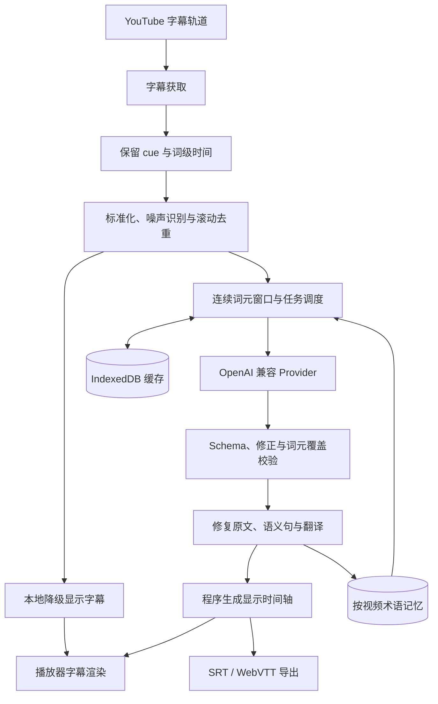

# CueWeave 系统架构

本文档定义 CueWeave 的稳定模块边界、数据流和故障处理。产品功能与验收口径见[产品需求](PRODUCT_SPEC.md)，工程工具选型见[技术栈](TECH_STACK.md)。

## 数据流

模型只决定词元分组、翻译和候选转录修正，不生成或修改时间戳。原始转录始终只读保留；修复原文及每条显示字幕的开始、结束时间均由覆盖词元在本地生成。

## 运行上下文

### Background Service Worker

负责：

- 从 `chrome.storage.local` 读取 Provider 设置和 API Key；
- 申请用户选择的 API origin 运行时权限；
- 调用模型 API 并归一化错误；
- 管理任务优先级、并发、超时、退避和去重；
- 协调 IndexedDB 缓存与缓存失效；
- 在 Service Worker 被回收后从持久状态安全恢复。

API Key 不得通过消息传递给 content script，也不得写入日志、错误对象、遥测或导出文件。

### Content Script

负责：

- 检测 YouTube 单页导航和当前视频 ID；
- 获取可用字幕轨并监听轨道切换；
- 读取播放、暂停、倍速和进度跳转状态；
- 驱动字幕管线并向后台提交翻译任务；
- 创建隔离的播放器覆盖层；
- 处理普通、影院、全屏和 Shorts 布局；
- 视频切换时废弃旧会话，防止异步结果串入新视频。
- 维护原始转录、修复原文和译文三层状态，并向字幕工作台提供只读报告与完整翻译任务。

### Main-world Bridge

仅在 Chrome 隔离世界无法访问所需的 YouTube 页面对象或响应时启用。它只提取字幕轨信息和页面导航事件，通过带版本的窄消息协议发送给 content script。它不接收 Provider 配置、API Key 或翻译结果。

### Popup、Options 与字幕工作台

Popup 只承载高频操作：总开关、当前视频状态、显示模式、Provider、模型、翻译和导出入口。

Options 是以下设置的唯一完整入口：Provider、字幕行为、样式、断句、提示词、术语表、缓存、隐私和许可证。

字幕工作台是当前视频的检查与导出入口。它读取 Content Script 维护的报告，展示完整翻译进度、修正前后文本、类别、置信度和是否应用，并在本地序列化 SRT / WebVTT；它不读取 API Key。

## 领域模型

领域模型的唯一事实来源是 [`RawCue`、`TimedWord`、`SourceToken`、`SemanticSegment` 与 `DisplayCue`](../src/domain/subtitle/types.ts)。管线的公开入口由 [`src/domain/subtitle/index.ts`](../src/domain/subtitle/index.ts) 导出。

`RawCue` 与 `TimedWord` 保存 YouTube 时间事实；`SourceToken` 是交给模型的最小连续覆盖单位；`SemanticSegment` 表示完整语义；`DisplayCue` 表示播放器、导出和阅读速度约束下的一次屏幕显示。`DisplayCue.originalText` 保留原始转录，`sourceText` 保存经过高置信度修正后用于显示的原文，`translation` 保存译文，三者不得相互覆盖。`TranscriptCorrection` 保存修正范围、前后文本、类别、置信度与应用状态；`TranslationTerm` 保存视频内稳定的双语术语。语义结构和显示结构不得合并为同一类型。

## 字幕管线

### 1. 标准化与去重

处理 HTML 实体、空白、换行、重复标点、说话人标记、噪声标记、完全重复 cue、时间重叠和空字幕。对滚动字幕比较相邻 cue 的公共前缀与后缀，只保留新增文本。

噪声 cue 保留时间信息并标记为 `isNoise`，默认不进入翻译请求。是否显示由用户设置决定。

### 2. 本地降级显示

按词级时间、强标点、停顿、说话人变化、最大持续时间、最大字符数和时间不连续生成可立即显示的原文字幕。它是 Provider 不可用时的可靠降级，不作为最终语义断句结果。阈值必须集中配置，并由真实边界样本覆盖。

### 3. AI 语义重组

调度器将一个连续词元窗口及受限的视频标题、简介、频道、最近字幕、全视频重复专有名词和视频术语交给模型。模型返回窗口内的起止索引、翻译、句末标记、候选转录修正和术语；返回值必须符合 JSON Schema，并满足：

- 每个输入索引恰好被一个连续范围覆盖；
- 范围顺序与原字幕一致；
- 不出现越界、间断、遗漏或重复范围；
- `translation` 非空，原文由本地词元重建；
- 修正范围有界、有序、互不重叠且不跨 unit；只有置信度不低于 0.85 的明确错误自动应用；
- 拉丁字母或数字修正必须同时通过来源证据和编辑距离校验；单次出现且没有证据的陌生名称保持原样；
- 译文中的拉丁字母标识必须能追溯到当前字幕或可信上下文，模型不得凭空引入产品名和版本号；
- 本地从每个 unit 提取技术语境中的名称，并校验译文是否保留该名称或使用当前视频的可信映射；该校验是 unit 局部约束，不能被全视频中另一个已知名称绕过；
- 中文长度符合[产品需求](PRODUCT_SPEC.md#字幕显示)。

### 4. 本地显示切分、校验与降级

中文优先在播放器可用宽度内保持单行，只有实际接近播放器边缘时才自然换行。逗号、句号、分号和冒号只作为分句信号，不进入最终中文字幕；顿号保留，问号和感叹号用于保留语气，单个空格可以表达口语停顿但不构成 unit 边界。如果一个 unit 内出现两侧均可独立阅读的分句标点，本地校验会记录该 unit，并把它与左右相邻 unit 作为一个连续范围交给模型重新分组，使模型可以把错误归入前一句的词元移动到后一句。重叠的问题范围先合并，再与范围外的合格 unit 拼回完整结果。修复后的较小 unit 仍包含可独立分句的标点时，继续只处理包含其相邻 unit 的问题范围，最多执行三轮定向修复。定向修复已给出准确词元范围但仍残留分句标点时，本地只移除标点并使用模型给出的范围，不根据标点创建或猜测新的时间边界。过短片段只移除标点并保持原 unit。单条译文明显过长时，本地只要求模型复审从句、转折、让步和自然呼吸点，不直接采用字符数生成切点；复审确认没有自然边界后允许保留较长 unit。模型返回的每个 unit 都必须映射到准确的连续英文词元，本地不得按译文长度比例猜测原文时间。解析失败时先剥离常见 Markdown 代码围栏；普通结构或覆盖校验失败时，把无效结果和具体错误交给模型执行一次完整修复；已定位的语义分界错误执行有限次定向修复。修复结果无法满足结构或覆盖要求时使用本地显示字幕；翻译为空或 Provider 故障时保留原文。任何失败都不能阻塞视频播放。

## 调度

任务优先级依次为：

1. 当前播放位置所在语义段；
2. 播放位置之后的短期窗口；
3. 播放位置之前尚未完成的段；
4. 视频剩余部分。

拖动进度条期间不为经过的中间位置扩展任务；`seeked` 后立即强制检查新位置窗口。如果该窗口已作为预取任务排队，Content Script 会再次以当前位置优先级提交相同缓存身份，Background 队列共享原 Promise 并提升待执行任务，不产生重复模型请求。失败冷却按窗口记录，不得阻塞用户新跳转到的其他位置；叠层仅在当前位置缺少译文时显示处理状态，并为失败窗口提供显式重试。任务身份由视频、字幕轨、上下文窗口和翻译配置共同确定，防止重复请求。

当前窗口完成后串行预取前方三个词元窗口，通常覆盖约 90 秒。播放位置变化会提升新窗口为最高优先级，并使旧焦点在完成当前请求后停止继续预取，从而减少跨窗时的原文降级，同时避免在用户未继续观看时翻译整段视频。

Background 使用并发上限为 2 的稳定优先队列。当前位置任务先于等待中的预取任务执行，相同缓存身份的并发请求共享同一个 Promise。Content Script 为每次翻译焦点建立会话 ID；视频切换、轨道切换、seek、关闭翻译或改为仅原文时发送取消消息，Background 使用 `AbortController` 主动中止该会话仍在执行的网络请求。会话 ID、视频会话和焦点版本共同阻止旧结果写回或继续扩展预取链。

## 缓存

缓存键由以下稳定维度组成：

- 视频 ID；
- 字幕轨标识；
- 原始语言和目标语言；
- Provider Base URL 的非敏感标识；
- 模型名称；
- 请求协议；
- 提示词版本；
- 断句算法版本；
- 输入字幕内容摘要。
- 视频标题、简介、频道名称、全视频重复词和转录修正开关。
- 当前视频人工确认术语；自动发现术语不进入缓存键。

API Key 不进入缓存键。设置和小型索引放在 `chrome.storage.local`；整段字幕和翻译结果放在 IndexedDB。缓存实现必须有容量上限、LRU 淘汰、当前视频清除和全部清除操作。

当前实现把验证通过的窗口翻译保存在 `cueweave-cache` IndexedDB 中，默认最多 1,200 个窗口或 24 MiB，以先达到的限制为准。读取会更新最后访问时间；写入后按 LRU 淘汰。IndexedDB 不可用或写入失败时直接继续实时翻译，不影响播放。

视频术语按视频 ID 保存在 `chrome.storage.local`，并区分自动发现与人工确认两层。自动术语的来源词及译文中的拉丁字母标识必须先通过证据校验，再经过清洗、去重和容量限制；它们只供后续窗口使用，不因每次自动发现而使既有缓存失效。人工术语由字幕工作台通过受限消息写入，按来源词覆盖同名自动术语并进入缓存身份；修改后 Background 清除该视频 IndexedDB 译文、通知对应 Content Script 轮换会话，并从当前播放位置重新提交翻译。即使 IndexedDB 清理不可用，新的人工术语身份也不会命中旧译文。

## OpenAI 兼容协议

Provider 设置可固定为 Chat Completions、Responses，或使用自动检测。自动模式先请求 Chat Completions，只在端点不存在或响应无法解析时回退 Responses；认证、限流、超时和普通网络错误不会触发跨协议重复请求。

## 权限与安全边界

- 静态 host permission 只覆盖 YouTube 所需页面。
- 用户自定义模型域名使用 optional host permissions，并在保存或测试连接时申请。
- `chrome.storage.local` 使用 `TRUSTED_CONTEXTS` 访问级别，content script 只能通过窄消息读取非敏感状态。
- 主世界脚本不接触任何密钥或用户 Provider 设置。
- 日志只记录翻译阶段、窗口时间范围、耗时、缓存命中和错误类别，不记录 Authorization header、API Key、完整响应体或字幕正文。
- Content Security Policy 不允许远程脚本和动态代码执行。
- 字幕只发往用户主动选择并授权的 Provider。

## 错误分类

Provider 层将错误归一化为：配置错误、权限缺失、认证失败、模型不存在、限流、超时、网络故障、响应格式错误和内容完整性错误。界面给出发生位置和可执行的恢复操作，但不展示敏感请求内容。

视频切换、页面导航和 Service Worker 回收属于正常生命周期事件，不作为用户错误显示。
