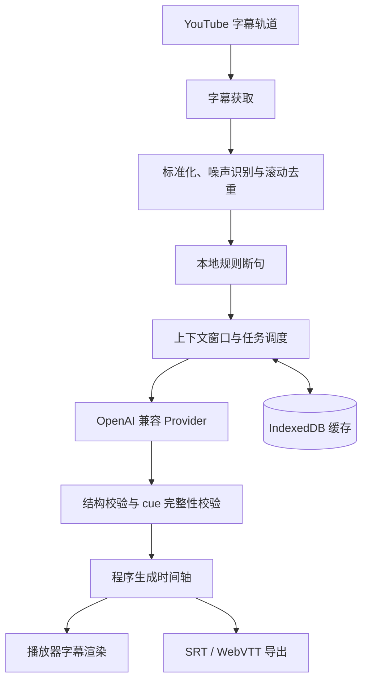

# CueWeave 系统架构

本文档定义 CueWeave 的稳定模块边界、数据流和故障处理。产品功能与验收口径见[产品需求](PRODUCT_SPEC.md)，工程工具选型见[技术栈](TECH_STACK.md)。

## 数据流



模型只决定 cue 分组、修复后的原文和翻译，不生成或修改时间戳。每个语义段的开始和结束时间由首尾 cue 在本地计算。

## 运行上下文

### Background Service Worker

负责：

- 从 `chrome.storage.local` 读取 Provider 设置和 API Key；
- 申请用户选择的 API origin 运行时权限；
- 调用模型 API 并归一化错误；
- 管理任务并发、超时、退避、取消和去重；
- 协调 IndexedDB 缓存与缓存失效；
- 在 Service Worker 被回收后从持久状态安全恢复。

API Key 不得通过消息传递给 content script，也不得写入日志、错误对象、遥测或导出文件。

### Content Script

负责：

- 检测 YouTube 单页导航和当前视频 ID；
- 获取可用字幕轨并监听轨道切换；
- 读取播放、暂停、倍速和进度跳转状态；
- 驱动字幕管线并向后台提交翻译任务；
- 创建隔离的播放器覆盖层；
- 处理普通、影院、全屏和 Shorts 布局；
- 视频切换时废弃旧会话，防止异步结果串入新视频。

### Main-world Bridge

仅在 Chrome 隔离世界无法访问所需的 YouTube 页面对象或响应时启用。它只提取字幕轨信息和页面导航事件，通过带版本的窄消息协议发送给 content script。它不接收 Provider 配置、API Key 或翻译结果。

### Popup 与 Options

Popup 只承载高频操作：总开关、当前视频状态、显示模式、Provider、模型、翻译和导出入口。

Options 是以下设置的唯一完整入口：Provider、字幕行为、样式、断句、提示词、术语表、缓存、隐私和许可证。

## 领域模型

```ts
interface RawCue {
  id: string;
  startMs: number;
  endMs: number;
  text: string;
}

interface NormalizedCue extends RawCue {
  normalizedText: string;
  speaker?: string;
  isNoise: boolean;
}

interface SemanticSegment {
  id: string;
  sourceCueIds: string[];
  startMs: number;
  endMs: number;
  sourceText: string;
  translation: string;
  status: "pending" | "translated" | "fallback" | "failed";
}
```

这些接口最终应由源码中的领域模块作为唯一事实来源；代码建立后，本文只保留概念和指向对应导出符号的链接。

## 字幕管线

### 1. 标准化与去重

处理 HTML 实体、空白、换行、重复标点、说话人标记、噪声标记、完全重复 cue、时间重叠和空字幕。对滚动字幕比较相邻 cue 的公共前缀与后缀，只保留新增文本。

噪声 cue 保留时间信息并标记为 `isNoise`，默认不进入翻译请求。是否显示由用户设置决定。

### 2. 本地规则断句

按强标点、停顿、说话人变化、最大持续时间、最大字符数和时间不连续切分。阈值必须集中在一个配置对象中，并由单元测试覆盖边界。

### 3. AI 语义重组

调度器将一段连续 cue 和有限上下文交给模型。请求包含稳定 cue ID；返回值必须符合 JSON Schema，并满足：

- 每个输入 cue ID 恰好出现一次；
- 顺序与原字幕一致；
- 不出现未知、遗漏或重复 ID；
- `sourceText` 与 `translation` 非空；
- 分段只覆盖请求允许的 cue 范围。

### 4. 校验与降级

解析失败时先剥离常见 Markdown 代码围栏，再执行一次严格重试。第二次失败后使用本地断句结果；翻译为空或 Provider 故障时保留原文。任何失败都不能阻塞视频播放。

## 调度

任务优先级依次为：

1. 当前播放位置所在语义段；
2. 播放位置之后的短期窗口；
3. 播放位置之前尚未完成的段；
4. 视频剩余部分。

拖动进度条后，调度器提升新位置附近任务，并取消或降低旧位置任务。任务身份由视频、字幕轨、上下文窗口和翻译配置共同确定，防止重复请求。

## 缓存

缓存键由以下稳定维度组成：

- 视频 ID；
- 字幕轨标识；
- 原始语言和目标语言；
- Provider Base URL 的非敏感标识；
- 模型名称；
- 提示词版本；
- 断句算法版本；
- 输入字幕内容摘要。

API Key 不进入缓存键。设置和小型索引放在 `chrome.storage.local`；整段字幕和翻译结果放在 IndexedDB。缓存实现必须有容量上限、LRU 淘汰、当前视频清除和全部清除操作。

## 权限与安全边界

- 静态 host permission 只覆盖 YouTube 所需页面。
- 用户自定义模型域名使用 optional host permissions，并在保存或测试连接时申请。
- 主世界脚本不接触任何密钥或用户 Provider 设置。
- 日志使用错误类别和请求 ID，不记录 Authorization header、完整响应体或字幕正文。
- Content Security Policy 不允许远程脚本和动态代码执行。
- 字幕只发往用户主动选择并授权的 Provider。

## 错误分类

Provider 层将错误归一化为：配置错误、权限缺失、认证失败、模型不存在、限流、超时、网络故障、响应格式错误和内容完整性错误。界面给出发生位置和可执行的恢复操作，但不展示敏感请求内容。

视频切换、页面导航和 Service Worker 回收属于正常生命周期事件，不作为用户错误显示。
