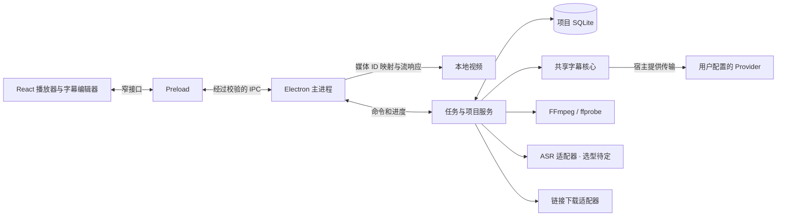

# CueWeave Desktop 开发规格

桌面端是共享翻译核心的宿主。翻译算法、提示词、三档预算与通用校验的归属和迁移要求见[共享翻译核心](TRANSLATION-CORE.md)；本规格继续负责媒体、项目、进程和人工编辑保护。只有 cue 时间的输入保留原条目，不能因为接入核心就自动启用词级重组。

本文定义桌面端的产品边界、模块职责、数据契约与验收要求，供 `apps/desktop` 实现使用。下文标为“拟定”的目录和接口是实现目标，不表示仓库已有对应能力；实际入口以[桌面工作区](../apps/desktop/package.json)为准。交付顺序与阶段门槛统一维护在[开发路线图](ROADMAP.md#桌面应用)。

## 产品目标与首版范围

CueWeave Desktop 是以视频播放为中心的本地字幕工作台。用户导入视频后，可以观看、生成或导入字幕、翻译、校对、保存项目并导出字幕。字幕处理在后台执行，播放不依赖模型服务是否可用。

首个可用版本面向 Windows x64，优先验收英语音频或英语字幕到简体中文的流程。其他语言须分别验证识别、分词、翻译提示词和导出，不能由 ASR 引擎支持某语言推断整条处理链已经支持。

| 范围     | 首版要求                                                                  |
| -------- | ------------------------------------------------------------------------- |
| 媒体     | 单个本地视频；文件选择和拖入；多音轨选择；格式探测与兼容性提示            |
| 播放     | 播放、暂停、拖动进度、倍速、音量、全屏；字幕同步；点击字幕定位            |
| 字幕输入 | 导入 UTF-8 SRT / WebVTT，或通过选定的 ASR 方案生成；保留原始输入          |
| 翻译     | 复用 OpenAI 兼容 Provider；支持完整视频任务、进度、失败重试和已有结果复用 |
| 校对     | 修改显示原文和译文、调整时间、撤销与重做；记录人工修改                    |
| 项目     | 自动保存；关闭后重新打开；媒体失联后重新定位；任务恢复                    |
| 导出     | 原始转录、修复原文、中文、双语 SRT / WebVTT；完整性检查                   |

视频链接导入的媒体获取部分已在 D0.6 接入，并在 D0.7 统一到 DOM 播放器：支持经实测通过的 YouTube、哔哩哔哩公开单视频和 HTTP(S) 媒体直链。基础观看使用流式播放，下载作为可选的离线功能；下载后的文件进入本地处理链。站点视频可选择最高 2160p（4K）的标准 SDR 清晰度和已有在线字幕；用户也可在句织的隔离登录窗口中登录站点，读取该账号有权访问的清晰度与字幕。首版不承诺任意网站、8K、HDR、杜比视界、DRM 视频、直播、播放列表或边下载边识别。批量任务在单视频流程稳定后接入；烧录字幕、配音、剪辑、云同步和多设备协作另立需求。

## 工作流程与界面

主窗口以播放器为中心，字幕列表位于侧边，任务状态与进度位于底部。项目与导入入口保持轻量；Provider、模型、存储和外观配置集中在设置中。延续 [DESIGN.md](../DESIGN.md) 的字体、图标、色彩与键盘可访问性规则；通过主题令牌和纯组件复用外观，不整体搬入扩展页面或其浏览器适配器。

标准流程：打开视频 → 选择音轨 → 导入字幕或识别音频 → 翻译 → 播放校对 → 导出。用户也可以只播放、只转录或只导出原文。开始识别前显示所选模型和音轨；开始翻译前显示所选 Provider 与目标语言。

- 进度分别表示下载字节、音频识别范围和翻译窗口，无法确定总量时显示阶段状态，不伪造整体百分比。
- 已提交的字幕结果可以立即查看。未完成范围与失败范围在列表中可定位，失败不清空已有结果。
- 用户可修改已完成字幕；后台结果不得覆盖人工修改。修改冲突交给版本规则处理，而不是按最后返回的请求覆盖。
- 全屏保持播放和字幕操作可用。空格与方向键等播放器快捷键在文本编辑框中让位于输入操作。
- 关闭主窗口默认退出应用；先保存并中断活动任务。首版不默认驻留托盘或继续产生模型请求。

## 工程选型与进程边界

桌面端采用 Electron、React、TypeScript 和原生 CSS，开发构建采用 electron-vite，安装包采用 electron-builder。electron-vite 分别配置主进程、preload 与 renderer 构建；具体依赖版本由桌面工作区与根锁文件维护，不在文档固定版本号。[electron-vite 构建说明](https://electron-vite.org/guide/)，[electron-builder 文档](https://www.electron.build/)。

本地媒体处理采用 FFmpeg / ffprobe 子进程；ASR 的本地或云端路线待调研确定，whisper.cpp 是本地路线候选；项目数据库采用 SQLite，通过 `better-sqlite3` 在受控后台进程中访问。原生模块和外部可执行文件必须在各自接入时尽早通过目标架构的打包实测，不能只验证开发模式。



| 模块           | 职责                                                         | 不承载的职责                                   |
| -------------- | ------------------------------------------------------------ | ---------------------------------------------- |
| Renderer       | 播放状态、字幕虚拟列表、编辑交互、进度展示                   | 任意文件读写、启动进程、读取已保存密钥         |
| Preload        | 暴露固定方法，转发 DTO，管理事件订阅与释放                   | 通用 `ipcRenderer`、任意 channel、任意命令执行 |
| Main           | 窗口、文件对话框、应用生命周期、IPC 校验、媒体协议、密钥存取 | 长时间解码、识别、扫描文件或处理大型字幕       |
| 任务与项目服务 | 项目数据库唯一写入者、持久任务、缓存、纯核心调用、子进程管理 | DOM、扩展 Service Worker 与浏览器存储          |
| 外部工具       | 受限输入下的媒体探测、转换、转录、下载                       | 决定项目状态或直接覆盖人工字幕                 |

任务与项目服务使用 Electron `utilityProcess` 承载。主进程监测退出并重新建立连接；任务进程重启后从数据库恢复，而不依赖内存 Promise。`utilityProcess` 提供独立进程和消息机制，不应将其当作自动限制外部工具权限的安全沙箱。[utilityProcess 文档](https://www.electronjs.org/docs/latest/api/utility-process)。

### 拟定目录

```text
apps/desktop/
  src/
    main/           # 窗口、IPC、媒体协议、密钥和服务生命周期
    preload/        # 固定桥接接口
    renderer/       # 播放器、字幕列表、任务与设置界面
    shared/         # 桌面 DTO、命令与运行时校验
    services/
      projects/     # 数据库、迁移、修订与备份
      jobs/         # 调度、检查点、取消与恢复
      media/        # 文件探测、音轨、播放代理、时间轴映射
      subtitles/    # 导入适配、两种翻译模式、人工修订
      asr/          # 引擎适配、模型管理、分块与识别结果
      downloads/    # 链接元信息、受控下载与恢复
  resources/        # 桌面静态资源及受控工具清单
  electron.vite.config.ts
  electron-builder.yml
```

这些模块按交付阶段逐步建立，不预先制造空实现。构建输出统一使用桌面工作区内被忽略的 `dist/`，与扩展根目录的 `.output/` 分开。运行中的项目、模型和缓存写入用户数据位置，不写入源码目录、安装目录或 `.eval`。

## 共享核心复用与缺口

包边界遵守[仓库结构](WORKSPACE.md)。桌面端只经 `@cueweave/core` 的公开入口引用共享逻辑，不导入 `apps/extension` 源码。

| 能力                               | 实现依据                                                                                            | 桌面端接入要求                                          |
| ---------------------------------- | --------------------------------------------------------------------------------------------------- | ------------------------------------------------------- |
| 字幕领域结构                       | [`RawCue`、`TimedWord`、`SourceToken`、`DisplayCue`](../packages/core/src/domain/subtitle/types.ts) | 在适配层补充来源、时间精度与修订信息                    |
| 清洗、窗口与校验                   | [字幕公开入口](../packages/core/src/domain/subtitle/index.ts)                                       | 区分来源；SRT 与 ASR 不能直接套用 YouTube 滚动去重      |
| 首轮翻译                           | [`translateFirstPass`](../packages/core/src/provider/firstPass.ts)                                  | 由桌面任务提供窗口、上下文、取消与结果持久化            |
| 网络传输与诊断                     | [`ProviderRuntime`](../packages/core/src/provider/runtime.ts)                                       | 使用桌面密钥与网络策略，不调用扩展权限 API              |
| 字幕导出                           | [`serializeSubtitles`](../packages/core/src/domain/subtitle/export.ts)                              | 增加桌面完整性门槛、快照和文件写入                      |
| SRT / WebVTT 导入、ASR、项目数据库 | 需要新增                                                                                            | 文件和引擎适配留在桌面端；稳定的纯解析与校验可抽入 core |

### 两种时间处理模式

现有 [`buildSourceTokens`](../packages/core/src/domain/subtitle/tokens.ts) 在词时间缺失或无法匹配文本时会使用 `fallbackTokens` 等分 cue 时间；`buildSourceTokens` 还会执行滚动字幕去重。它适合现有输入的降级路径，不能直接作为所有桌面字幕的精确时间事实。

**保留时间模式**是导入 SRT / WebVTT 及仅有段级 ASR 时间时的默认路径。每条源 cue 作为不可拆的时间单元，模型按 cue ID 返回译文，可以读取邻近上下文，但不改变分组、顺序和开始结束时间。长文本先换行，不能按译文长度拆出新的时间边界。这个翻译入口需要新增，不能直接把现有词元重组器当成已经具备的能力。

**词级重组模式**仅在输入提供经过验证的词级对齐时启用。适配器显式声明时间精度，并以可信词时间构造连续词元；默认保留有意重复的口语，仅在 ASR 分块重叠区域处理重复输出。模型决定连续覆盖范围，时间由本地映射，不能生成新时间戳。缺少对齐、中文分词不兼容或文本与词时间不一致时，回到保留时间模式。

whisper.cpp 的词级时间能力在上游标为实验性，ASR token 也不等同于自然语言单词。因此初次接入先保证段级时间可靠，不能因为 CLI 输出了 token 时间就默认通过词级重组验收。[whisper.cpp 时间戳说明](https://github.com/ggml-org/whisper.cpp#word-level-timestamp-experimental)。

## 媒体导入与播放

文件由主进程接收并登记为媒体 ID；拖入文件也必须由宿主解析、检查和登记。渲染层只取得展示信息和 `cueweave-media://` 播放地址，不取得可读取任意路径的接口。

播放协议由 `protocol.handle` 实现，只映射已登记媒体及应用生成的播放代理。协议按媒体用途启用流支持，保留 CSP 和路径边界；实现需验证 `HEAD`、字节 Range、`206` / `416`、内容类型、取消读取与大文件 seek。不能将整个视频读入内存再返回。[Electron protocol 文档](https://www.electronjs.org/docs/latest/api/protocol)。

媒体探测记录容器、视频和音频编码、时长、起始时间、音轨和旋转信息。文件扩展名不能决定能否播放；浏览器能力探测也不能替代加载后的错误处理。先验证 MP4 H.264/AAC、WebM VP9/Opus，再把 MKV、HEVC、多音轨与变帧率样本纳入兼容性实验。

可直接播放时使用原文件；无法播放时提供生成兼容副本的动作。可重封装时避免重编码，需要转码时明确时间、磁盘占用和进度。副本写入可清理缓存，原视频保持不变。工具选择不宣称支持所有格式。

项目的字幕时间统一为视频播放时间轴上的毫秒。提取音轨、切块和生成代理时保留到原媒体的时间映射，验证非零起始时间、音画起点差、变帧率和选中音轨。换音轨使对应 ASR 与下游翻译失效；仅 seek 或倍速播放不产生新识别任务。FFmpeg 的流选择和时间处理参数以固定工具版本的实测为准。[FFmpeg 文档](https://ffmpeg.org/ffmpeg.html)。

## ASR 与模型管理

ASR 选型与实验暂缓，独立于 D0 推进；本地或云端路线由后续调研决定。选型前不下载引擎或模型、不接入付费识别服务。以下 whisper.cpp 和本地模型管理条目是选择本地路线后的候选要求；云端路线须先补齐上传授权、凭据、成本、数据保留、取消与恢复契约，再进入实现。

`AsrEngine` 适配器提供能力查询、执行、取消和规范化输出；输出保留原始引擎结果、语言、片段时间、可选词对齐和时间精度。若选择 whisper.cpp，先验证 CPU 路径，以 multilingual `base` 作为实验基线；默认推荐模型须在目标设备上测量质量、耗时和内存后确定，不承诺实时识别。GPU 支持作为单独能力检测与验收项。

音频按照引擎输入契约转为单声道、16 kHz、PCM 16-bit WAV；这个格式属于 ASR 中间文件，不改变用户视频。[whisper.cpp 输入说明](https://github.com/ggml-org/whisper.cpp#quick-start)。长媒体按有限时长分块，禁止整片 PCM 常驻内存。

分块记录源范围、重叠区、模型身份、参数和完成状态。重叠区按时间与文本共同消重，不能删除范围外相同的重复台词；块内时间映射回全局时间。静音、音乐、低置信度片段和不连续时间进入诊断，不用模型猜出的文本补齐整片。已提交块可复用，未完成块在恢复时重跑；分块大小和重叠参数在 ASR 验收中确定并纳入缓存身份。

模型独立存储于用户数据目录，安装包不捆绑全部模型。模型管理支持从受控来源下载和用户导入；下载先写临时文件，验证大小与清单中的 SHA-256 后启用。导入的自定义模型验证可加载性并计算身份，不把自算哈希当作来源可信证明。中断下载可以续传或重下，损坏模型不能标记可用；正在使用的模型禁止删除。

运行清单记录引擎版本、目标平台、模型文件哈希、语言、音轨和识别参数。发布时工具与模型的下载来源、校验值和许可证跟随资源清单维护，不能在运行时静默执行未经校验的新程序。

## 项目文件与持久化

一个项目对应一个视频。首版采用项目目录 `项目名.cueweave/`，包含 `project.sqlite` 和必要的导入字幕副本；这是目录格式，不是可以只复制数据库主文件的单文件包。原视频默认按引用保存，用户可显式选择复制到项目媒体目录。应用用户数据保存最近项目、全局设置、模型、密钥密文和可清理缓存。

数据库启用事务和 schema 迁移，由任务与项目服务单写。自动保存每次已确认编辑、每个完成的识别块和翻译窗口；界面只有在事务提交后才显示已保存。数据库迁移前制作一致备份，失败保持原库可恢复；遇到更高 schema 版本时拒绝写入。SQLite 的备份使用数据库备份机制，不能直接复制运行中启用 WAL 的主文件。[better-sqlite3 事务与备份 API](https://github.com/WiseLibs/better-sqlite3/blob/master/docs/api.md)。

| 数据                | 关键内容                                                       |
| ------------------- | -------------------------------------------------------------- |
| Project             | 项目 ID、schema、修订号、媒体 ID、活动字幕轨、语言和播放位置   |
| MediaAsset          | 原路径、相对路径、内容身份、大小、时长、流信息、音轨与代理映射 |
| SubtitleTrack       | 来源、语言、只读原始 cue、引擎信息、时间精度、输入修订号       |
| TranslationRevision | 输入身份、Provider 非敏感配置、提示词身份、窗口结果和覆盖状态  |
| ManualEdit          | cue 身份、基准修订、改动字段、原值和新值；与模型结果分离       |
| Job / Checkpoint    | 阶段、状态、参数快照、已完成块或窗口、错误与重试信息           |
| CacheEntry          | 输入指纹、产物位置、大小、访问时间、可重建属性                 |

使用媒体大小和修改时间快速检查变更，但不把路径或文件名作为唯一身份；后台计算内容身份用于重用结果和重新定位校验。视频移动后可重新定位，内容不同则作为替换媒体处理并使依赖结果失效，不静默沿用旧字幕。

项目原始数据、人工修改和完成的字幕结果不属于可清理缓存。临时 PCM、代理视频和可重新下载的数据可按容量策略清理；清理不能删除活动任务使用的文件。历史任务诊断按保留策略管理，不将调试日志无限写入项目。

## 持久任务与编辑一致性

处理图为“导入或下载 → 探测 → 字幕导入 / 音频提取与 ASR → 翻译 → 导出”。播放、编辑和项目保存不必等待全图结束。首版同一时刻只运行一个重型识别或转码任务；Provider 并发独立限制并支持服务端限流。整片字幕逐块流入存储，渲染端按页读取。

| 状态                   | 语义                                         |
| ---------------------- | -------------------------------------------- |
| queued                 | 输入已确认，等待资源或前置阶段               |
| running                | 正在执行，进度来自实际工作量                 |
| pausing / paused       | 停止启动新块；当前块完成并保存后暂停         |
| cancelling / cancelled | 立即中止请求和子进程；保留已提交结果         |
| interrupted            | 应用、系统或任务进程退出；重新打开后等待恢复 |
| failed                 | 记录失败原因与可重试范围；保留已完成部分     |
| completed              | 本次任务所有目标范围完成并提交               |

缺少密钥、模型、媒体或磁盘空间时，返回可操作的阻塞原因，不持续自动重试。恢复前重新核对媒体、模型、输入修订和配置身份；已持久化块跳过，未完成块重新执行。Provider 调用不能保证远端恰好执行一次，崩溃在响应落盘前可能造成重试计费，因此重启后不自动恢复付费调用。

暂停只保证检查点边界；对尚不支持检查点的单个工具阶段只开放取消。取消有超时，并清理所启动的进程树，不能留下后台 FFmpeg 或 ASR。Windows 下以明确的可执行文件路径和参数数组启动工具，不拼接 shell 命令；工具适配层负责进程归属与退出确认。

任务键由媒体内容身份、音轨、字幕输入修订、模型或 Provider 非敏感身份、处理参数和管线身份组成，不含 API Key。同键去重；同一输入的人工修订始终叠加于机器结果之上。重新转录、更换源字幕或调整时间模式创建新修订，旧修订仍可查看。

编辑命令携带 `baseRevision`，服务端事务检查版本并返回新修订。过期编辑或过期任务结果不得写入当前修订；需要明确冲突或保存为旧任务结果。人工时间调整验证有限数值、先后顺序和媒体范围，记录修改来源；自然重叠字幕可保留，但不得由排序操作悄悄改写时间。首版支持字段编辑与时间调整，合并、拆分和重新对齐作为后续编辑能力。

## IPC、文件与密钥

拟定桥接接口按动作命名，例如 `project.open`、`media.pick`、`subtitle.import`、`subtitle.update`、`job.start`、`job.pause`、`job.cancel`、`job.retry` 和 `subtitle.export`。所有请求经过运行时 schema 校验；长任务立即返回任务 ID，通过可取消订阅报告事件，不占用一个长时间未完成的 IPC 调用。

命令携带请求 ID、项目 ID 与必要的基准修订；事件携带项目 ID、任务 ID、执行代次和单调序号。界面重新订阅先取快照，再应用更新事件，忽略其他项目和过期代次。错误 DTO 只包含稳定错误码、可读原因、重试能力和受控诊断 ID，不跨桥传递内部异常对象或密钥。

渲染窗口使用 `nodeIntegration: false`、`contextIsolation: true` 和 `sandbox: true`。preload 单独打包，仅暴露固定函数；主进程验证调用来源、参数和资源所有权，限制页面导航与新窗口，字幕与标题按文本显示，生产 CSP 只允许必要的本地资源。链接导入通过下载适配器处理，不把远程网页加载到拥有桌面桥接能力的窗口。[Electron 安全指南](https://www.electronjs.org/docs/latest/tutorial/security)。

文件选择和保存对话框由主进程管理。访问依据已授权的媒体 ID、项目目录或保存目标，不接受渲染层任意路径；防止路径穿越、符号链接越界和跨项目访问。下载与转换工具使用受控输出位置、参数和配置，不能继承用户目录里未知的工具配置或插件。

用户输入密钥后通过专用保存动作提交，立即清空输入；已保存密钥不回传 renderer。密文留在应用用户数据，由主进程通过 `safeStorage` 保护；执行请求时按需传给受控任务服务，任务快照、项目、日志和导出都不保存密钥。加密不可用时只允许本次会话使用，不能悄悄明文落盘。`safeStorage` 不等于能防护同一用户权限下的恶意程序。[safeStorage 文档](https://www.electronjs.org/docs/latest/api/safe-storage)。

本地识别不上传视频或音频；若采用云端 ASR，上传前须由用户确认服务和音频范围。翻译只发送所需字幕及用户选择的上下文到所配置 Provider。支持本机 Provider，远程地址使用 HTTPS；网络请求由宿主执行，重定向不得将凭据转发给其他 origin。链接下载、模型下载、云端识别和翻译分别报告网络活动与错误。

## 字幕导入与导出

SRT / WebVTT 导入先解析，再报告空字幕、无效时间和不支持的结构。首版接收 UTF-8 与 BOM，其他编码明确报错；保留原文件，渲染安全的文本内容。无法完整保留的样式、位置或 VTT 元数据应说明其处理结果，不以“导入成功”掩盖丢失。

导出基于数据库中的一致修订快照，不读取正在变化的界面状态。沿用共享序列化能力并增加桌面导出门槛：

- 原始转录仅要求源轨完整；中文、双语和修复原文要求目标范围处理完成且覆盖校验通过。
- 存在失败或缺失时定位待处理范围。部分导出必须由用户显式选择，标明范围与不完整状态，不能冒充完整字幕。
- 输出应用当前人工修订，检查时间与空内容；原始转录仍可独立导出，不受人工修改影响。
- 先写同目录临时文件，完成序列化与回读检查后再替换目标；用户取消、磁盘不足或进程退出不得留下伪装为完整结果的文件。

## 链接导入

站点视频采用 yt-dlp 适配器，媒体直链走受控下载器。先取得元信息、可用清晰度和字幕轨道，再选择在线播放或下载到项目管理位置；默认不展开播放列表、不使用登录状态、不加载外部插件。用户主动打开站点官方页面并登录后，Electron 在独立持久会话中保存 Cookie。解析、字幕读取和下载只临时导出当前站点需要的 Cookie，任务结束后删除临时文件；Cookie 不传给 renderer。元信息、响应体、磁盘用量、重定向次数和超时都设边界，网络失败保留可续传的临时下载。

yt-dlp 的站点能力与依赖会变化。当前验收组合为 yt-dlp 2026.08.19、Deno 2.9.6 与随包 FFmpeg；下载器工具清单记录版本、校验值和许可证，升级后重新运行站点样本。站点不可用时允许继续本地导入。[yt-dlp 依赖与选项](https://github.com/yt-dlp/yt-dlp#dependencies)。

取得已有字幕时，用户可选择直接使用或重新识别；二者建立独立来源轨。下载完成后复用本地媒体的探测、时间映射、翻译和导出流程，不为链接另建字幕引擎。付费、登录、DRM 与平台授权问题不通过桌面端绕过。

## 验证与发布要求

| 验证层   | 关键验收                                                                                |
| -------- | --------------------------------------------------------------------------------------- |
| 纯逻辑   | SRT / VTT 回读、两种时间模式、词元覆盖、分块边界与重复台词、人工修订、缓存身份          |
| 服务集成 | SQLite 事务与迁移失败、进程崩溃恢复、取消进程树、旧代次结果、磁盘不足、媒体重新定位     |
| 网络模拟 | 超时、限流、无效响应、取消、断网、重定向凭据隔离；不依赖真实密钥                        |
| 桌面交互 | 原生文件选择、中文与空格路径、字幕定位、倍速与全屏、虚拟列表、编辑不被后台覆盖          |
| 媒体实测 | 音画偏移、变帧率、长视频 seek、多音轨、不支持编码、损坏输入、静音与快速重复台词         |
| 安装包   | 无 Node / Python / 全局 FFmpeg 的机器上启动、原生模块加载、工具定位、项目恢复、完整导出 |

ASR 验收记录设备、模型身份、处理时长、峰值内存、识别误差、字幕起止偏差及误差样本；词级重组必须额外检验词对齐。播放器在后台处理期间持续可操作；至少使用一段一小时级视频验证磁盘与内存不会随整片音频解码无限增长。性能阈值在前期实测后确定，禁止将演示片段耗时推广为普遍性能承诺。

依赖在 npm workspace 内安装，不覆盖根配置或生成第二份锁文件。桌面命令在可执行入口建立后加入 `apps/desktop/package.json`，根目录再添加对应转发；开发环境 Node 与 Electron 内置 Node 分别验证。共享核心变更必须保持扩展类型检查、测试和构建通过。

发布资源清单包含原生模块、FFmpeg / ffprobe、ASR、下载工具和模型的来源与许可证；可执行资源正确放置于打包后的资源位置，不假设工作目录或系统 PATH。字体沿用官方 MiSans 文件与许可，版权归属在关于或第三方声明中呈现。首次分发先完成 Windows 安装包和签名验证，自动更新在安装与项目迁移可靠后另行接入。
